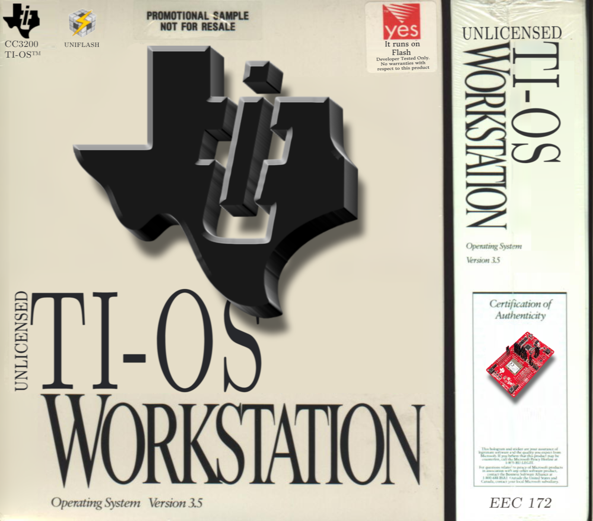

# TI-OS: Embedded Operating System

A sophisticated embedded systems project that transforms the TI CC3200 microcontroller into a miniature personal computer experience.

## Overview

TI-OS is an embedded systems project that aims to replicate the user experience of a personal computer through the hardware of the TI CC3200. Through the management of real-time graphics, application switching, and a simplified physical interface, the "closed loop" intuitive behavior of a more complex operating system is accomplished on the limited hardware of the microcontroller.

## Features

### System Architecture
- **Hierarchical Desktop-based Application Scheme**: Navigate through applications using a desktop interface
- **Cursor-Based Navigation**: Intuitive point-and-click interface adapted for embedded hardware
- **Real-time Graphics Management**: Smooth rendering and application switching on limited hardware

### Physical Control Interface
- **Analog Joystick**: Primary navigation and cursor control
- **Two Push Buttons**: Selection and menu navigation
- **Buzzer Speaker**: Audio feedback and notifications
- **BMA222 Accelerometer**: Motion-based input for interactive 3d cube application
- **128x128 OLED Screen**: Graphics display
- **SF006C Servo-controlled Helping Hand**: Actuated clamp for use in soldering and other electronics projects

### Application Suite
The system includes a diverse range of utility and entertainment applications:

- **Function Generator**: Signal generation with configurable waveforms
- **Oscilloscope**: Real-time waveform analysis and visualization
- **AWS IoT Integration**: Cloud connectivity for data logging and remote monitoring
- **Video Game**: Interactive entertainment demonstrating real-time graphics
- **3D Cube Renderer**: Accelerometer-controlled 3D graphics showcase
- **Servo Control Interface**: Direct motor control and automation

## Bill of Materials

| Component | Qty | Cost | Source |
|-----------|-----|------|--------|
| TI CC3200 LaunchPad | 1 | $0 | Lab |
| Pan-Tilt Servo | 1 | $13 | Alibaba |
| Analog Joystick | 1 | $4 | Alibaba |
| Buzzer | 2 | $2 | Alibaba |
| OLED Display | 1 | $0 | Lab |
| Buttons | 1 | $1 | Alibaba |
| Wires & Tools | — | $5 | Personal |
| Breadboard | 1 | $5 | Owned |
| GPT API Key | — | $10 | OpenAI |
| **Total** | | **$40** | |

## Prerequisites

- TI Code Composer Studio (CCS)
- TI CC3200 SDK
- AWS account (for IoT features)
- OpenAI API key (for AI-enhanced features)
- Physical Components

## Installation & Setup

1. **Hardware Assembly**
   - Connect all components according to the wiring diagram (see figure below)
   - Ensure proper power connections and ground references
   - Test individual components before full integration

2. **Software Environment**
   - Install TI Code Composer Studio
   - Clone this repository
   - Import the project into CCS
   - Create an AWS device and save the required certificates.
   - Configure your network name and password in common.h
   - Configure your AWS device and server location in AWSIoT.c
   - Configure your AWS IoT and OpenAI credentials in iot_shadow_client

3. **Flashing the Firmware**
   - Connect the CC3200 LaunchPad via USB
   - Build the project in CCS
   - Flash the required firmware to the device

## Usage

1. **System Startup**: Power on the device to see the desktop interface
2. **Navigation**: Use the analog joystick to move the cursor
3. **Selection**: Press the primary button to select applications or menu items
4. **Application Switching**: Use the secondary button to return to the desktop
5. **Motion Control**: Tilt the device to interact with accelerometer-enabled apps

## Contributing

This project was developed as part of an embedded systems course (EEC 172). Contributions, bug reports, and feature suggestions are welcome through GitHub issues and pull requests.

## License

This project is open source and available under the MIT License.

## Acknowledgments

- TI for the CC3200 platform and development tools
- Course instructors and lab support
- Open source embedded systems community
