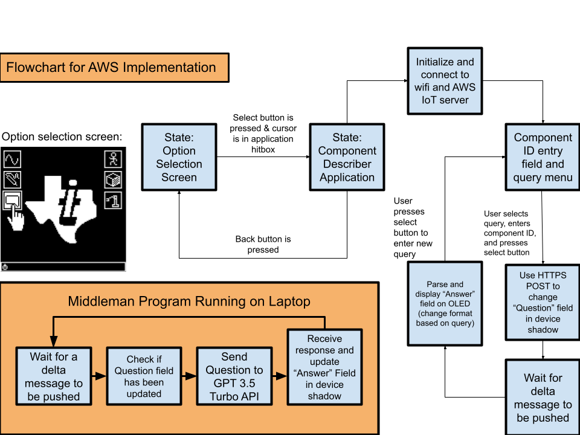
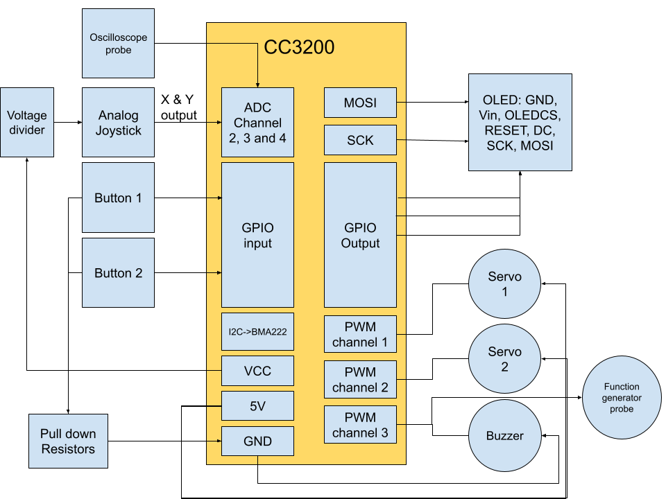

# Project Proposal: TI-OS

## 1. Overview:
TI-OS is a multi-functional program and physical interface that is meant to deliver a rudimentary simulation of what a personal computer based on the CC3200 would look like. A top level "desktop" menu will allow the user to select between several applications that demonstrate the different functionalities of the microcontroller. These applications will be focused on the use of TI-OS as an electronics assistant, such as an oscilloscope, function generator, and servo controlled "helping hand" for soldering. However, there will also be some demos of the real time graphical capabilities of the system, with a platformer video game and wireframe 3D physics simulation. The IoT implementation of the device will be an application that helps the user identify the pinout, function, and purpose of any named electronic component through the use of interfacing with the OpenAI GPT 3.5 Turbo API. 

Physical Interface: The user will interact with TI-OS via an analog stick to control a cursor, and two buttons to select and exit programs. In terms of output, the CC3200 will drive an OLED screen to display the graphical interface, and use a buzzer to provide basic sound feedback to the user. The "helping hand" will be articulated by two servo motors and controlled using the analog stick.

---

## 2. Design
### Functional Specification:

The top level operating system will have 7 states:
- **Desktop Option Select Screen**: A cursor is controlled by the user with the joystick, and clicking on icons with the select button enters their respective application. This is the main high level program, and every application runs by rendering single frames via function calls within this main loop. This allows the user to exit to the desktop by pressing the back button and selecting a different application.
- **Function Generator**: Probe connected to a PWM modulation channel creates periodic signals for driving electronics. Users can use the OLED screen, joystick, and select button to select frequency, waveform, and amplitude.
- **Videogame**: Simple 2D platformer that takes joystick input to control a character, and the select button to jump. Bitmap information is used to define map collisions.
- **Oscilloscope**: A scrolling graphical representation of the voltage measured by an ADC channel. The user can use the joystick to change the x and y scale.
- **Wireframe Physics Simulator**: The BMA222 Accelerometer is used as input for a 3-D physics simulation of a wireframe cube in a box. The cubes physical movement will reflect how the CC3200 is tilted by the user.
- **Servo Control**: The user controls the servo arm’s pan and tilt via analog joysticks. ADC on the CC3200 interprets the input, and PWM signals control the servos.
- **Component Descriptor**: The user can trigger predefined GPT queries from physical buttons or a menu system, and responses are shown on the OLED screen.

### System Architecture:
Most of the applications do not have IoT functionality, and thus have simple, similar state management of taking an input from the ADC or GPIO, and determining the single frame output for the OLED and PWM channels. The Component Descriptor (fig.1), however, is the most sophisticated, and requires interfacing with the GPT API through first updating the AWS device shadow, then reading that update with a middle-man python script which interacts with the GPT API, then updating the device shadow and having the microcontroller read it. This is done to reduce the amount of parsing and API interfacing code that has to be run locally on the CC3200, as it is memory intensive and slows the user interface.
One implementation element that is shared across all applications is the use of bitmaps for animation and static UI. These are generated by a helper program that turns .gif images into arrays of monochrome binary pixel indicators, which are then converted to .bin files by another helper program and stored in the CC3200 file system using Uniflash. These are stored in the file system because the unoptimized maps can take up to 2048 bytes and fill up the RAM very quickly.

### Board Connections Overview:
These are the main connections made to the CC3200 Launchpad, visualized in the Connections Overview Diagram (fig.2).
- **I2C PINS** reads BMA222 Accelerometer for interaction with 3D cube simulation and platformer video game.
- **ADC PINS** reads joystick input and oscilloscope input pin.
- **PWM PINS** drives pan/tilt servo motors and buzzer.
- **Wi-Fi** is used to connect the CC3200 to the GPT API for sending queries and receiving answers.
- **OLED display** shows user interface and system status.

---

## 3. Implementation Goals (2 points)

- **Minimal Goal**: GPT integration with a few selectable prefilled questions and response output to the OLED, top level desktop selection interface, 3D wireframe physics sim.
- **Target Goal**: Servo control with analog joystick input and OLED display showing position/mode, oscilloscope, platformer video game.
- **Stretch Goal**: Function Generator with several waveform output options, more complex graphical representation of GPT output, integration of I2C 7-segment display for oscilloscope voltage readings.

---

## 4. Bill of Materials (2 points)

| Component                   | Qty | Approx. Cost | Source                 |
|----------------------------|-----|--------------|------------------------|
| TI CC3200 LaunchPad        | 1   | $0           | Provided in lab        |
| Pan-Tilt Servo Kit         | 1   | $13          | Alibaba (already owned)|
| Analog Joysticks           | 2   | $4           | Alibaba (already owned)|
| Buzzer                     | 2   | $2           | Alibaba (already owned)|
| OLED Display (SPI)         | 1   | $0           | Provided in lab        |
| Buttons                    | 1   | $1           | Alibaba (already owned)|
| Wires & Prototyping Tools  | —   | $5           | Lab / Personal Stock   |
| Breadboard                 | 1   | $5           | Already owned          |
| GPT API Key (OpenAI)       | —   | $10          | OpenAI                 |

**Estimated Total Cost:** ~$40 (within $50 budget)

---

fig.1:Component Descriptor State Diagram

fig.2:CC3200 Connections Overview Diagram
